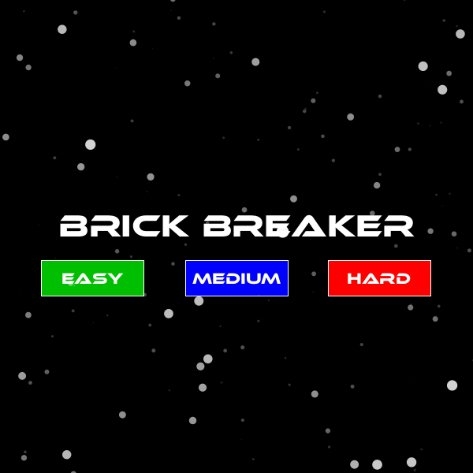

# Brick Breaker
This weekend I was reminiscing the Brick Breaker game on the good old days Blackberry so I thought I'd make my version of the game using some CS concepts I learned during my first year of CS courses. Hence using my knowledge on Java, Processing and OOP I made the brick breaker game.

## Gameplay
Initially, the player is greeted with a home screen where the player can choose one of three game modes: easy, medium and hard. There is only one key difference between each game mode; the speed of the ball. The background of the home screen is also made in Processing. When the player selects the game mode they are taken straight into the game, where the player gets 3 lives. There are three mani types of collisions in the game itself:

### 1. Ball-Wall Collision:
This is the most basic type of collision in the game which bounces the ball off the edges of the game's window. This is implemented by using the x and y values of the ball and comparing that to the width and height of the window. So, when the ball collides with the left side of the window, it moves to the right. When the ball collides with the right side of the window, the ball moves to the left. When the collides with the top of the window, it goes down. And the player looses a life when the ball moves under the base/paddle.

### 2. Ball-Base Collision
This collision occurs when the ball makes contact with the base (which moves with the cursor's X value and maps it to the X value of the base). This is implemented by using the x and y values of the ball and comparing that to the X values of the base. So, when the ball collides with the left side of the base, it bounces to the left. When the ball collides with the right side of the window, the ball bounces to the right.

### 3. Ball-Brick Collision 
This collision occurs when the ball makes contact with any brick (the bricks are stored in a 2-D array in which each array element is a Brick Object). This is implemented by using the x and y values of the ball and comparing that to the x and y values of each brick. So, when the ball collides with the left side of the brick, it removes the brick and bounces to the left. When the ball collides with the right side of the brick, the brick is removed and the ball bounces to the right. When the ball makes contact with the top of the brick, it removes the brick and bounces upwards. When the ball collides with the bottom of the brick, it removes the brick and bounces downward.

## Future Improvements
Due to the fact that only 4-5 hours were spent collectively to make the game; there is some room for improving it in the future.

-Making a more efficient way to store the bricks and removing them (potentially a 1-D array/arraylist).
-Improving the physics sim for eg: when the ball hits the brick the brick and ball must deform slightly to make the collision look realistic.

## Here's some gameplay: 

